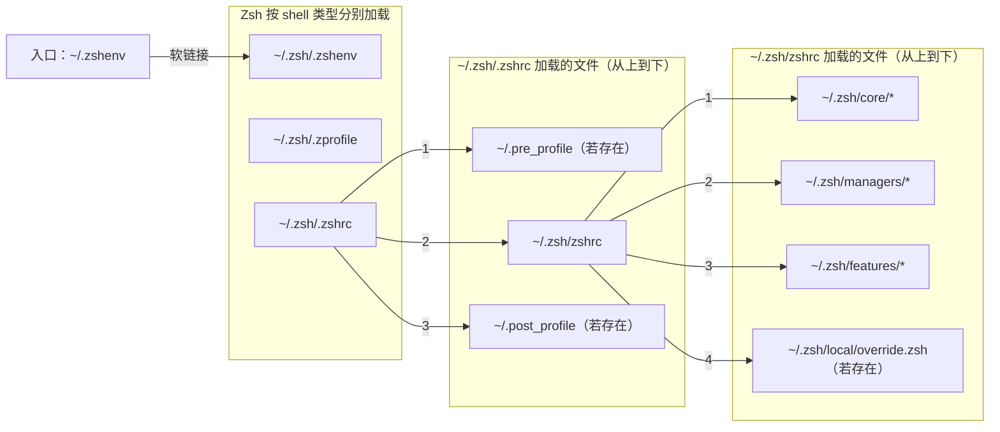

# 🛠️ Forgo7ten's Dotfiles

这是我的个人 Dotfiles 仓库，基于 **chezmoi** 管理。

## 📥 快速安装

只需运行以下命令即可自动初始化环境。该脚本将安装必要的依赖并应用配置文件。

-    方式 1: 使用 curl

```bash
bash -c "$(curl -fsLS https://raw.githubusercontent.com/Forgo7ten/dotfiles/main/setup.sh)"
```

-    方式 2: 使用 wget

```bash
bash -c "$(wget -qO - https://raw.githubusercontent.com/Forgo7ten/dotfiles/main/setup.sh)"
```

## Zsh 加载顺序

部署后，Zsh 从 `~/.zshenv` 开始，按以下真实文件顺序加载：




...
